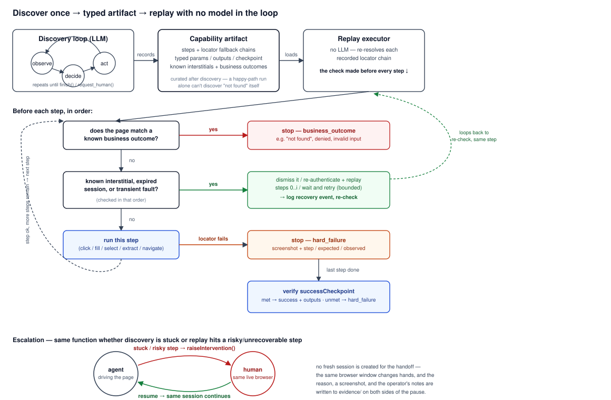

# Design Report — Computer-Use Automation System

**For reviewers scanning quickly:** the load-bearing pieces are the artifact schema (§2 — locator fallback chains with confidence/rationale, not a step list) and the replay error taxonomy (§3 — business outcome vs. recoverable vs. hard failure, as a discriminated type, not a comment). Three real bugs were found and fixed by actually running the system against a live LLM, not by inspection — each is documented at the point in this report where it was caught, with what it would have silently broken. `evidence/` backs every claim below with a real run: a genuine discovery, five replay scenarios including two real cross-tenant *failures* before the fix that made it work, and a 5-run stability check. Nothing here is a description of a system — it's a report on one that was actually exercised.

## 1. Architecture

The system is one Node/TypeScript process with no services, queues, or databases — a deliberate simplicity choice, since the brief explicitly penalizes premature scaling infrastructure. Five modules, each with one job:

- **`src/agent`** — the discovery loop. An LLM (Groq, tool-calling) observes the page, calls exactly one semantic tool per turn (`click`, `fill`, `extract_labeled_value`, `finish`, `request_human`, …), and the loop accumulates the resulting steps into a capability.
- **`src/surface`** — the only code that touches Playwright. `observe.ts` turns the live page into a compact accessibility-tree summary (Playwright's `ariaSnapshot()`, not a screenshot); `act.ts` turns a semantic intent ("click the button named X") into a real action *and* a locator fallback chain; `locate.ts` resolves a saved chain back into a live element, used identically by discovery-time verification and production replay.
- **`src/artifact`** — the `Capability` schema (Zod), storage, and `parameterize()`, which rewrites literal values the model happened to use into `{{templateParams}}`.
- **`src/replay`** — the deterministic executor: no LLM, a discriminated result type, and the three-way error taxonomy described below.
- **`src/escalation`** — one function, `raiseIntervention()`, called identically by discovery and replay.

**Discovery doesn't trust the model's self-report, either.** When the model calls `finish`, the loop re-verifies its claimed `successCheckpointText` against the *live* page before accepting it — not because the model is assumed adversarial, but because it was observed in practice: the model reached the confirmation screen, navigated elsewhere to read a value for its final answer, and then called `finish` still citing checkpoint text that was no longer on screen. A capability recorded from that unverified claim would never satisfy its own checkpoint on replay. Separately, Groq's on-demand tier has a low tokens-per-minute ceiling and this loop resends the full growing message history every turn, so a multi-step discovery run hits 429s in practice, not just in theory — `callGroqWithRetry` honors the API's own `retry-after` rather than treating a rate limit as a hard failure. Both fixes came from running discovery for real, which is the point of the brief's "the discovery run has to be real" requirement — these are exactly the failure modes a description of the system would never surface.

**Key trade-off — accessibility-tree text over screenshots, and Groq over a vision model.** The brief explicitly invites "screenshot + coordinates" as a fair option, but the environment description (legacy web, framesets, table layouts, *no test IDs*) is precisely the case where an accessibility tree is the more durable signal: roles and accessible names survive CSS/markup churn in a way pixel coordinates don't, and it keeps the whole decide-step model-agnostic — no vision capability required. That's what makes Groq's fast, cheap tool-calling models a legitimate choice here instead of a compromise; if a target surface had no usable accessibility tree at all (a canvas-rendered app, for instance), this would break down and a vision-based approach would be the right call instead. I'm naming that boundary explicitly rather than pretending one approach covers everything.

**Why the LLM never writes selectors.** The agent's tool vocabulary is semantic (`click(role, name)`, `fill(label, value)`), never raw CSS/XPath. `src/surface/act.ts` is solely responsible for turning that intent into a locator chain. This keeps a model from ever inventing a brittle one-off selector, and it means the exact same locator-building logic backs both what gets recorded and what a human reviewer reads.

## 2. Artifact schema

A `Capability` (`src/artifact/schema.ts`) is a versioned, Zod-typed contract, not a step list:

- **`steps[]`** — each step has an `intent` (the "why," for a human reviewer), a `riskLevel` (safe/reversible vs. risky), and for anything that targets an element, a **locator fallback chain**: ordered strategies (`role+name` → `label` → `text` → structural `css`/`xpath` → `coordinates`), each carrying a `confidence` and a `rationale`. Replay tries them in order and reports which one actually resolved — so drift is visible, not silent.
- **`inputParams[]` / `outputs[]`** — typed (string/number/boolean), each with a description, `required`, and `sensitive`. `parameterize()` only declares a param if some step actually references it — the contract can't claim to need something it doesn't use (caught as a real bug during testing: an unused literal was being declared as a required param).
- **`successCheckpoint`** — a `CheckpointCondition` (text present/absent, URL match, or element-visible), asserted at the end, not assumed.
- **`knownInterstitials[]` / `businessOutcomes[]`** — this is the schema's answer to "the discovery run only ever walks the happy path." A single successful run can't discover "member not found" itself. A curation pass (`src/replay/known-conditions.ts`, run automatically after discovery for this app family) attaches the runtime conditions a reviewer already knows about — each as its own `matchCheckpoint` plus, for interstitials, a `dismissAction`. This is a first-class part of the artifact, not a side-channel.
- **`provenance`** — goal, target, model, discovery run ID, timestamp. Traceability from capability back to the run that produced it.

Sensitive values are never written to the artifact as literals: `act.ts` templates them (`{{password}}`) at the moment of recording, keyed off a normalized param name (`toParamName`) shared with how the CLI declares those params — a real bug caught in testing was a casing mismatch here (`{{Password}}` recorded vs. `password` declared), which is exactly the kind of silent contract break this schema is meant to make loud instead of quiet.

## 3. Determinism & error handling

**A checkpoint must never target a value that changes per invocation.** This bit in practice: the live discovery run cited the specific (randomly generated) new account ID as its success checkpoint. That ID is different on every real creation, so a capability recorded that way could satisfy its own checkpoint exactly once — on the run that discovered it — and never again. Caught during curation by simply trying to replay the raw artifact and watching it hard-fail with "checkpoint not satisfied," which is the system working as intended (a checkpoint that can't be met is a hard failure, not a silent pass) — the fix was retargeting the checkpoint at the stable confirmation text the page always renders ("Sub-account created successfully") rather than the ID. The same discipline applies to `businessOutcomes[]` and `knownInterstitials[]` match patterns: only stable, invocation-independent text belongs in a checkpoint.

Replay (`src/replay/executor.ts`) walks the saved steps with **no model in the loop**, resolving each locator chain the same way discovery verified it. Before every step (and once more after the last step, since a condition can be produced by the final action too — e.g. a confirmation interstitial that only appears after the final submit), it checks the current page against the capability's own known conditions plus a small set of generic, app-family-level conditions the engine always watches for:

| Category | Example | Handling |
|---|---|---|
| Business outcome | "no such member", validation error, permission denied | Stop, return `{status:"business_outcome", code, detail}` — a legitimate result, not a crash |
| Recoverable — known interstitial | large-deposit confirmation dialog | Auto-dismiss via the artifact's own `dismissAction`, log a recovery event, continue |
| Recoverable — session timeout | "session has expired" | Re-authenticate, then **replay every step before the failure point** (not just a login prefix — see below), then continue |
| Recoverable — transient | "temporarily unavailable" | Bounded wait-and-retry (3 attempts, backoff) |
| Hard failure | unrecognized server error, locator chain exhausted, checkpoint never satisfied | Stop, screenshot, and return exactly which step, what was expected, what was observed |

The result is a discriminated union (`success | business_outcome | hard_failure | escalated`), so callers can't accidentally treat "no such member" as a failure or a crash as a business result.

**A real design correction worth stating plainly:** the first version of session-timeout recovery only re-ran the recorded login steps, on the assumption that "logged in" was enough state to resume from. Testing it against a deliberately-expired session (mock app's dev fault-injection endpoint) showed that's wrong whenever the failure happens later in the flow — after re-login you're back on the search page, not wherever step *i* actually expected to be, and the executor would then try to extract a value from the wrong page. The fix: session recovery replays **all** steps before the failure point, not a fixed prefix. That's safe here because every pre-extract step in this flow is idempotent (navigation and reads); a capability whose early steps include a non-idempotent mutation would need step-level idempotency awareness before this recovery strategy could apply safely — noted in Cuts.

Risky steps (anything classified as mutating — `fill`/`select` feeding toward a submit) are gated through the same escalation mechanism for confirmation before replay executes them unattended, rather than being executed silently.

## 4. Heterogeneity & multi-tenant

**Surface abstraction.** The seam is `src/surface/observe.ts` + `act.ts` + `locate.ts`: the rest of the system (artifact schema, replay executor, escalation) only ever deals with `{role, name}`-shaped locator strategies and text/URL checkpoints, never raw DOM. To extend to a genuinely markup-less surface (a desktop app), only that seam changes — `observe()` would read the OS accessibility tree instead of a Playwright ARIA snapshot, `act()` would drive OS-level automation instead of Playwright calls, and the `LocatorStrategy` union would gain a strategy kind or two (e.g. a native automation ID) — but the `Capability` schema, replay executor, and escalation model are untouched, because they were never coupled to "browser" in the first place.

**Multi-tenant reuse — implemented, not just described.** `tenant-a` and `tenant-b` in this repo are the same underlying app with different branding, terminology ("Member" vs. "Customer"), a schema-drift column, and — deliberately — a differently-labeled button (`"Open Sub-Account"` vs. `"Create New Sub-Account"`). A `TenantOverride` (`src/canon/override.ts`, `generate-override` CLI command) is a small, reviewable diff: `stepId → replacement locator chain`, tried *before* the base chain, which remains as fallback. `generateLabelDriftOverride()` detects the specific drift this repo's two tenants have (comparing known per-tenant label config) and emits the override automatically; in a system with many tenants, the same shape would be populated by a human reviewer, or by diffing a failed replay's actual DOM against the recorded one, rather than by this small heuristic. The base capability is never re-recorded — only a small override is added.

**Detecting drift at scale.** Drift shows up as a `hard_failure` with the exact step and locator chain that failed — the raw material for a reviewer to write an override. `src/replay/stability.ts` (`npm run stability-check`, brief §8) takes the first real step past that: replay the same capability N times and report a genuine pass/fail distribution (`evidence/README.md` §5 has a real 5-run report — 100% success, with per-run timing that varies 1.4s–24.8s, which a single anecdotal run would never show). That's a signal, not a solution — it tells you *that* something is drifting, one capability and one tenant at a time, not *why* across a fleet. At real scale, the natural next step is what the "confidence & approval" stretch goal describes: track that same per-run status over time per `(capability, tenant)` pair, and when a specific tenant's success rate drops, surface a drift alert with the failing step attached, gating unattended replay behind an approval state — deliberately not built here, since it's fleet-management infrastructure the brief explicitly says not to build prematurely, not because the data model doesn't already support it (the stability report already has the shape that alerting would consume).

## 5. Escalation & handoff

Two escalation paths share one control-transfer model — `controlState: "agent" | "human"` tracked explicitly in every `InterventionRequest`, so "who's driving" is never ambiguous:

**Local path** (`raiseIntervention()`) — the default. Automation stops issuing Playwright commands, writes the request (reason, goal, screenshot, page URL) to `evidence/`, and blocks on *this process's own terminal*. The human takes the real, visible headful Chrome window directly — same OS process, same Playwright `page`, same cookies/session. On resume, a second screenshot and the operator's notes are recorded.

**Remote-operator path** (`raiseRemoteIntervention()` + the `operator-attach` CLI command, `--remote-operator` flag) — a genuinely separate process attaches to the *same* live browser and resolves the intervention, proving the control-transfer model across a process boundary, not just a code path within one. This was originally scoped as "the documented extension, not built" — it's now built and evidenced (`evidence/README.md` §6), and finding the right mechanism took a real, informative wrong turn worth stating: the first attempt used `chromium.launchServer()` + `chromium.connect()` (Playwright's own client-session protocol). Empirically — not by inspection, by actually running two processes against it — a second `connect()` call does not see contexts the first process created; `browser.contexts()` came back empty even after waiting. Chrome DevTools Protocol doesn't have that limitation, since it reflects real browser-process state rather than a Playwright-client-scoped session, so the fix launches Chrome directly with `--remote-debugging-port` and both processes attach via `chromium.connectOverCDP()`. The paused process publishes that endpoint and polls the filesystem for a resolution file instead of blocking on its own stdin; the separate `operator-attach` process connects, finds the exact page by URL, takes a confirmation screenshot (visible proof it's the same session), prompts *its own* terminal for operator notes, and writes the resolution the paused process is waiting for.

**Scope note (as the brief explicitly allows):** what's still a deliberate stub is the operator's *UI* — a terminal prompt, not a console — since the brief explicitly permits mocking that as long as the handoff mechanism itself is real. It now is, across a real process boundary.

## 6. Safety

- **Allowlist** (`src/safety/allowlist.config.json`, loaded not hardcoded): explicit permitted origins, permitted action types, and which action types count as risky. Every navigation and every action type is checked against it (`PolicyViolation` thrown otherwise) — both during discovery and replay, the same enforcement path.
- **Risk classification**: mutating action types (`fill`, `select`) are risky by default; reads and navigation are safe. Risky steps are gated behind the same escalation mechanism rather than executed unattended by default — conservative by construction, not by convention.
- **Redaction**: `src/safety/redact.ts` is applied to every log line and every artifact write — pattern-based (SSN/card/email/bearer-token/API-key shapes) *and* field-name-based (drops values for `password`/`token`/`ssn`/etc. keys outright). This is defense in depth: the primary control is that secrets are never captured as literals in the first place (sensitive fills are templated at the moment of recording, see §2), and redaction is the backstop for anything that primary control misses.
- **Limits of this model**: the allowlist is static config, not dynamically negotiated per-tenant; risky-step confirmation is a single blanket gate on first encounter, not a per-action-type policy; and redaction is pattern-based, so a genuinely novel-shaped secret could slip past it. Concretely: `redact.ts` catches structured fields (`{password: "..."}`) and pattern-shaped secrets (tokens, API keys) but does *not* scan free-text fields like a goal description for an embedded plain-English credential — visible in `evidence/` itself, where the mock app's test credential (`operator123`, intentionally public, documented in `README.md`) appears verbatim in a couple of intervention records because it's part of the goal string, not a structured field. Harmless here since it's not a real secret, but a real deployment would need free-text scanning too, not just structured-field and pattern-based redaction. None of these are hidden — they're the honest edges of a "thin but real" implementation.

## 7. Cuts

- **Multi-tenant and desktop support are designed for, not built** — one concrete surface (web) was implemented, per the brief's explicit scope.
- **Session-timeout recovery assumes idempotent prior steps.** Replaying every step before the failure point is correct here because nothing before the extract step mutates data; a capability with an earlier non-idempotent step would need per-step idempotency markers before this recovery strategy is safe to apply blindly. Not implemented; flagged rather than silently assumed away.
- **Cross-tenant drift detection is a hand-authored heuristic** (checks every text-carrying locator for the two known terminology/label differences between this repo's two tenants), not a general UI-diffing engine. Real scale needs either a human-in-the-loop review queue or a success-rate/confidence signal (see §4) — deliberately not built, since the brief asks not to reward premature scaling infrastructure.
- **The operator "console" is a terminal prompt**, not a graphical UI — intentional, since the brief explicitly allows mocking this as long as the handoff mechanism itself is real; the mechanism (§5) now runs across a genuine separate process over CDP, only the front-end is a stub.
- **On stretch goals — three implemented, not the suggested one or two, worth justifying rather than glossing over.** Capability interface and cross-tenant reuse are real subsystems (`src/capabilities/`, `src/canon/`). The third, multi-run stability (`src/replay/stability.ts`), is qualitatively smaller — it adds no new execution path, just N calls to the replay engine that already exists plus a pass/fail aggregation, and it directly strengthens "correctness of the core loop" and "robustness," the criteria the brief weights above generalization. I judged that a cheap, targeted reinforcement of already-central criteria was worth the departure from "one or two," not a data point toward breadth for its own sake — but I'm calling out the departure rather than letting it pass silently, since noticing your own rule-bending is part of the judgment being evaluated here.
- **Confidence/approval gating on unattended replay** (the stretch goal that *would* have made stability data actionable, e.g. blocking auto-replay below a success-rate threshold) is the one I cut. Not attempted — the stability report already has the shape a gate would consume, but building the gate itself is fleet-management policy, not core-loop depth, and stacking a fourth stretch goal past three felt like the actual line to hold.
- **What I'd build next**: the confidence/approval gate above, and a real operator UI (a small web page rendering the confirmation screenshot with approve/reject) in place of the terminal prompt on top of the now-real remote-attach mechanism.
